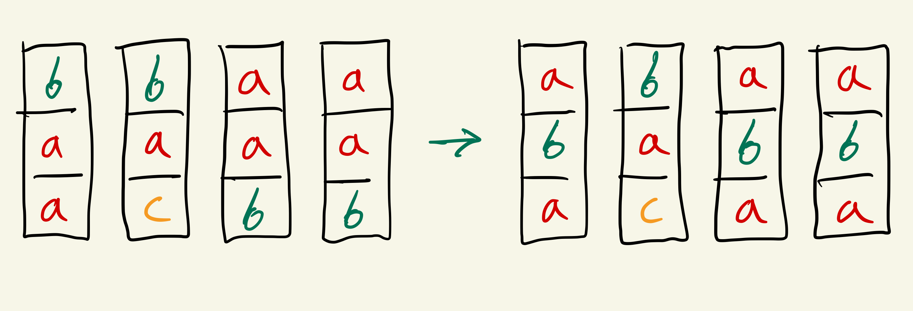
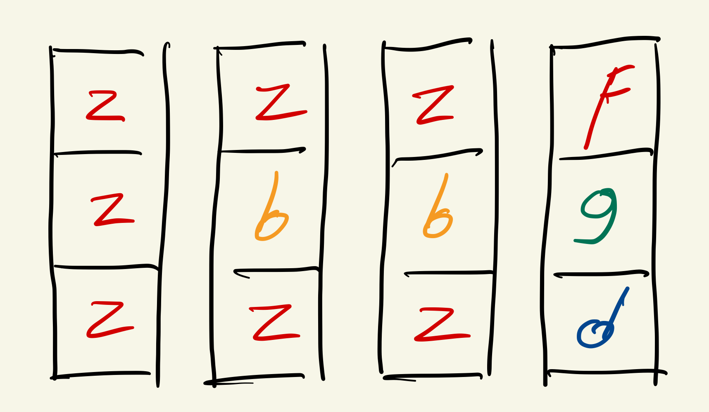

### The Joy of The First One

Tenemos una lista de muchos números, pero solo nos interesa encontrar los 50 primeros
elementos, encuéntralos en el menor tiempo posible...

Escribe un algoritmo eficiente teniendo en cuenta:
* El arreglo es muy grande (200.000.000)
* Para ir más rápido acércate a O(n)
* El tiempo de ejecución debe ser menor a 2 segundos

### Can you find me?

¿Puedes encontrar los primeros 20 enteros positivos faltantes en el array?

Escribe un algoritmo eficiente para encontrarlos, teniendo en cuenta:

* El arreglo puede contener muchos elementos, hasta 150.000.000
* Pueden existir números positivos y negativos.
* Si el arreglo tiene N elementos, el mayor elemento en el arreglo será N-1
* El tiempo de ejecución debe ser menor de 7 segundos.
* Tip: El runtime esperado es O(n)

## Bonus
### Funny Color Blocks

Existen N torres, cada una compuesta de 3 bloques, cada bloque puede ser de un color distinto, los colores se representan por letras (a-z)

Para cada torre, podemos intercambiar las 2 primeras o las 2 ultimas posiciones. Si mucho una vez.

Cuál es el máximo numero de torres del mismo color que podemos obtener?

Ejemplos:

1. Si tenemos las torres  ["aab", "cab", "baa", "baa"], el resultado debe ser 3.

2. Si tenemos las torres = ["zzz", "zbz", "zbz", "dgf"], el resultado debe ser 2.

Escribe un algoritmo eficiente teniendo en cuenta:

* Pueden existir entre 1 y 10.000.000 de torres
* Cada torre es un String de 3 letras (a-z)
* Tip: el runtime esperado es O(n)

